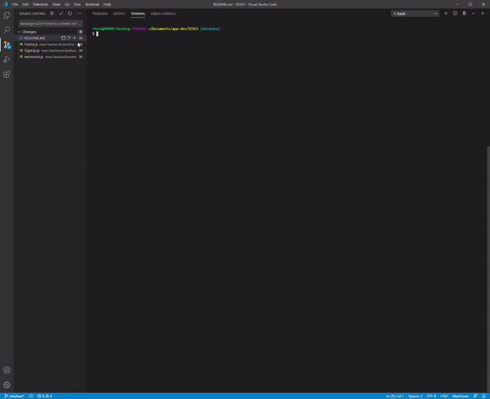

# eLibrary Suite

The eLibrary Suite is a webapp that aims to simplify how users interact with an eLibrary system. It is based on a clean and minimal concept that focuses on providing eResources to all users and maintaining a simple user experience for various stakeholders within a University.

This app was built upon the MERN Stack, The following frameworks and libraries were used
- [React](https://reactjs.org/)
- [Express](https://expressjs.com/)
- [Mongo DB Atlas](https://www.mongodb.com/cloud/atlas)
- [Node](https://nodejs.org/en/)

## Installation

Checklist:
- Ensure you have the git bash terminal installed on your machine
- Ensure you have node.js installed on your machine

### Installing Dependencies

Open your bash terminal inside of the _react-backend_ folder

`npm install` at the react-backend directory

Go forward into the client directory by running `cd client` and then run `npm install`

Go back to the react-backend directory by running `cd ..`

> Start the app by running `npm start` at the **react-backend** folder directory

### Installation Demo

## Usage
### Available Scripts

In the project directory /SESG3/react-backend, you can run:

### `npm start`

Runs the app in the development mode. 
Open [http://localhost:3000](http://localhost:3000) to view it in the browser.  

The page will reload if you make edits. 
You will also see any lint errors in the console.

